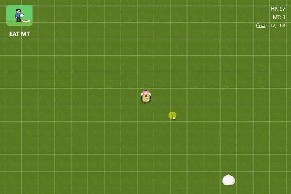
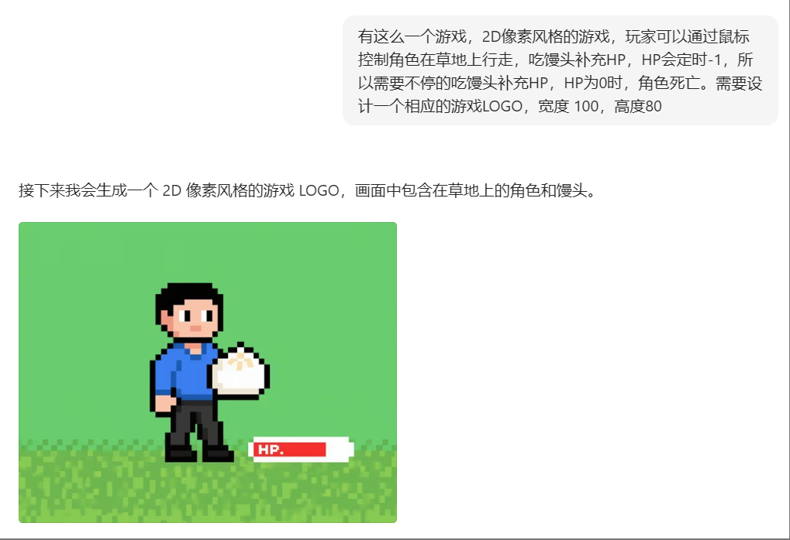
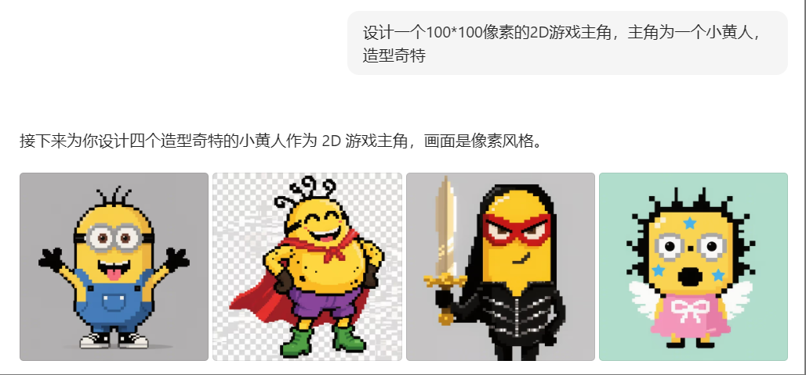
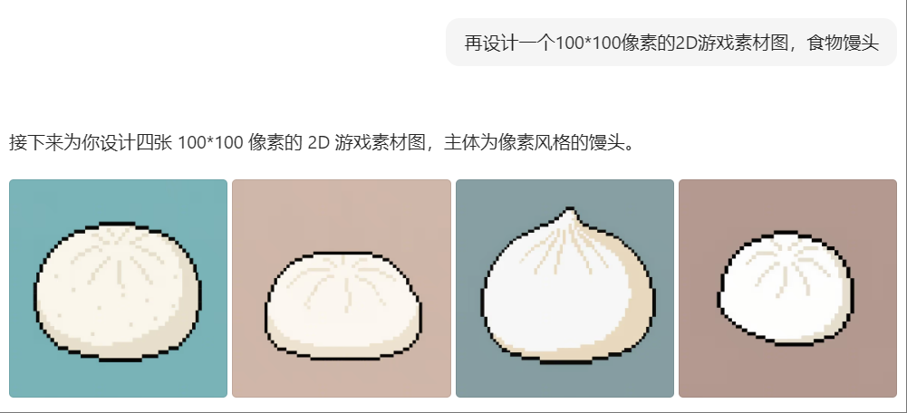
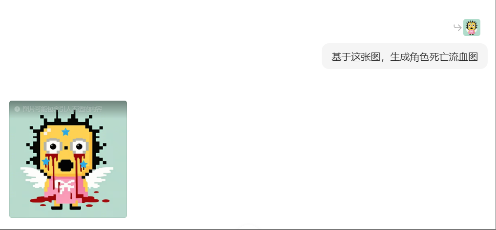

# ai-works: 人工智能艺术创作集 🎨

  

Most of the code in this repository is generated by AI.

## Categories 👩‍💻
> ⚠️ GIF图太大，压缩过了，看起来有点卡，实际运行很流畅。

#### Matrix Rain 🌩️

  [🔗 代码地址](https://github.com/mrhuo/ai-works/matrix-rain/src)

  > 制作工具：使用豆包生成的代码，加手动调节。

  

#### EAT MT 🍙

  [🔗 代码地址](https://github.com/mrhuo/ai-works/eat-mt)

 

  > 制作工具：角色、道具、地图瓦片、都是豆包生成的，百度图片在线编辑工具去背景色。
  > 代码由豆包生成，再由Trae进行调整。
  > 计划：后续增加多人在线游戏功能，让游戏更加有趣。

  几个生成过程中的提示词：
  
  
  
  
  

## Acknowledgments 🙏
- [豆包](https://www.doubao.com/)
- [Trae](https://www.trae.com.cn/)
- [opengameart](https://opengameart.org/)

## License 📜

This project is licensed under the MIT License - see the [LICENSE](LICENSE) file for details.
