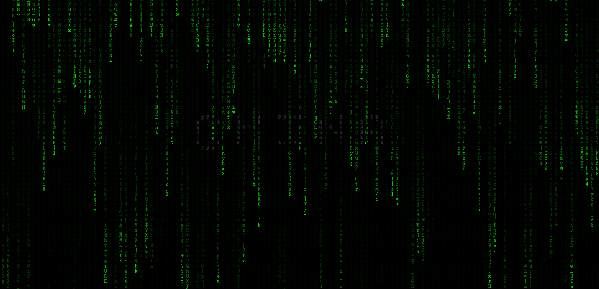

# ai-works: 人工智能艺术创作集 🎨

  

Most of the code in this repository is generated by AI.

## Categories 👩‍💻

- Matrix Rain 🌩️ [Preview](https://github.com/mrhuo/ai-works/matrix-rain)
  

## Acknowledgments 🙏
- [豆包](https://www.doubao.com/)
- [Trae](https://www.trae.com.cn/)

## Contributing 🤝

Contributions are welcome! Please read the [CONTRIBUTING.md](CONTRIBUTING.md) for details on our code of conduct, and the process for submitting pull requests to us.

## License 📜

This project is licensed under the MIT License - see the [LICENSE](LICENSE) file for details.
